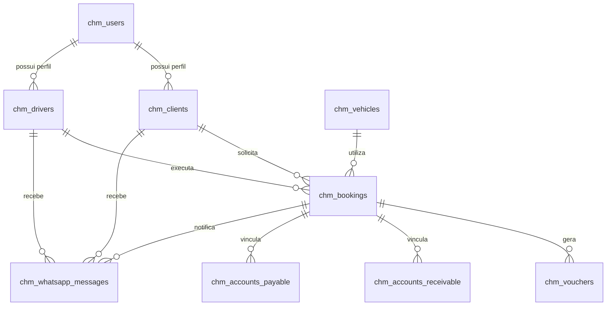
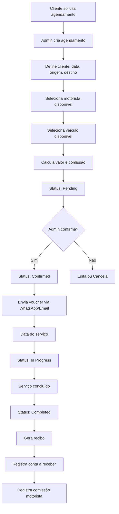

# 📊 Análise Técnica do Sistema CHM

**Autor:** ch-mestriner (https://ch-mestriner.com.br)  
**Data:** 26/12/2025 16:40  
**Versão do Sistema:** 2.3.1  
**Status:** Em Produção  
**URL:** https://chm-sistema.com.br

---

## 🎯 Visão Geral do Sistema

O **CHM Sistema** é uma aplicação web completa para gestão de transportes executivos, desenvolvida em PHP puro com arquitetura MVC moderna. O sistema gerencia agendamentos, clientes, motoristas, veículos, financeiro e integração com WhatsApp Business.

### Stack Tecnológico

| Camada | Tecnologia |
|--------|------------|
| **Backend** | PHP 7.4+ (Puro, sem framework) |
| **Arquitetura** | MVC com PSR-4 Autoloader |
| **Banco de Dados** | MySQL 8.0 / MariaDB |
| **Frontend** | HTML5, CSS3, JavaScript Vanilla |
| **PWA** | Progressive Web App (Service Worker + Manifest) |
| **Servidor Web** | Apache 2.4 (.htaccess) |
| **Integração** | WhatsApp Business API |

---

## 🏗️ Arquitetura do Sistema

### Estrutura de Diretórios

```
CHM-SISTEMA/
├── app/                           # Aplicação principal
│   ├── assets/                    # Recursos front-end
│   │   ├── css/app.css           # Estilos principais
│   │   ├── icons/                # Ícones PWA
│   │   └── js/                   # Scripts JavaScript
│   ├── auth/                      # Autenticação
│   │   ├── AuthController.php
│   │   └── UserModel.php
│   ├── bookings/                  # Agendamentos
│   │   ├── BookingController.php
│   │   └── BookingModel.php
│   ├── calendar/                  # Calendário
│   ├── clients/                   # Clientes
│   ├── config/                    # Configurações
│   │   ├── config.php            # Config principal
│   │   ├── env_loader.php        # Loader de ambiente
│   │   └── env.production.php    # Variáveis de produção
│   ├── core/                      # Classes base
│   │   ├── Database.php          # Conexão PDO
│   │   ├── Router.php            # Sistema de rotas
│   │   ├── Controller.php        # Controller base
│   │   ├── Model.php             # Model base
│   │   ├── Session.php           # Gerenciamento de sessão
│   │   ├── Validator.php         # Validações
│   │   ├── Helpers.php           # Funções auxiliares
│   │   ├── BackupService.php     # Backup automático
│   │   └── NotificationService.php
│   ├── database/                  # Schema e migrações
│   │   ├── schema.sql            # Schema completo (19KB)
│   │   ├── schema-production.sql # Schema otimizado
│   │   ├── migrations/           # Migrações versionadas
│   │   └── migrate.php           # Executor de migrações
│   ├── drivers/                   # Motoristas
│   ├── finance/                   # Financeiro
│   │   ├── FinanceController.php
│   │   └── FinanceModel.php
│   ├── pwa/                       # Progressive Web App
│   │   ├── manifest.json
│   │   └── service-worker.js
│   ├── reports/                   # Relatórios
│   ├── vehicles/                  # Veículos
│   ├── views/                     # Templates
│   │   ├── layouts/main.php      # Layout principal
│   │   ├── auth/                 # Views de autenticação
│   │   ├── bookings/             # Views de agendamentos
│   │   ├── calendar/             # Views de calendário
│   │   ├── clients/              # Views de clientes
│   │   ├── dashboard/            # Views do dashboard
│   │   ├── drivers/              # Views de motoristas
│   │   ├── finance/              # Views financeiro
│   │   ├── reports/              # Views de relatórios
│   │   ├── vehicles/             # Views de veículos
│   │   └── whatsapp/             # Views WhatsApp
│   ├── vouchers/                  # Vouchers e Recibos
│   ├── whatsapp/                  # Integração WhatsApp
│   │   ├── WhatsAppController.php
│   │   └── WhatsAppService.php
│   └── index.php                  # Bootstrap (242 linhas)
├── backup/                        # Backups automáticos
├── logs/                          # Logs do sistema
├── scripts/                       # Scripts auxiliares
├── install.php                    # Instalação inicial
├── cron-backup.php               # CRON de backup
└── migrate-production.php        # Migração para produção
```

---

## 🗄️ Banco de Dados

### Estrutura Completa (14 Tabelas)

#### 👥 Gestão de Pessoas

| Tabela | Descrição | Campos Principais |
|--------|-----------|-------------------|
| **chm_users** | Usuários do sistema | id, email, password, profile (1=Admin, 2=Motorista, 3=Cliente), status |
| **chm_clients** | Clientes (PF/PJ) | id, user_id, type (pf/pj), document (CPF/CNPJ), name, trade_name, contatos, endereço |
| **chm_drivers** | Motoristas | id, user_id, name, document, cnh, cnh_category, cnh_expiry, commission_rate, type (próprio/terceirizado), dados bancários |

#### 🚗 Gestão Operacional

| Tabela | Descrição | Campos Principais |
|--------|-----------|-------------------|
| **chm_vehicles** | Veículos | id, plate, brand, model, year, category, seats, owner, insurance_expiry, maintenance, status |
| **chm_bookings** | Agendamentos | id, code, client_id, driver_id, vehicle_id, service_type, date, time, origin, destination, value, commission, payment_method, payment_status, status |

#### 💰 Gestão Financeira

| Tabela | Descrição | Campos Principais |
|--------|-----------|-------------------|
| **chm_accounts_payable** | Contas a Pagar | id, description, supplier, due_date, value, paid_value, status, recurrent, driver_id, booking_id |
| **chm_accounts_receivable** | Contas a Receber | id, description, client_id, booking_id, due_date, value, received_value, status |
| **chm_vouchers** | Vouchers e Recibos | id, booking_id, code, type (voucher/receipt), sent_at, sent_method |

#### 📱 Integração WhatsApp

| Tabela | Descrição | Campos Principais |
|--------|-----------|-------------------|
| **chm_whatsapp_messages** | Mensagens | id, message_id, phone, direction, type, content, template_name, status, client_id, driver_id, booking_id |
| **chm_whatsapp_templates** | Templates | id, name, category, content, variables (JSON) |
| **chm_whatsapp_tags** | Tags Dinâmicas | id, tag (#cliente, #data, etc), field_reference |

#### ⚙️ Sistema

| Tabela | Descrição | Campos Principais |
|--------|-----------|-------------------|
| **chm_settings** | Configurações | id, key, value, type, group |
| **chm_logs** | Logs de Auditoria | id, user_id, action, module, description, data (JSON), ip_address |
| **chm_backups** | Registro de Backups | id, filename, size, type (auto/manual), status |

### Relacionamentos Principais



---

## 🔐 Sistema de Autenticação e Rotas

### Middlewares Implementados

1. **auth**: Verifica se usuário está autenticado
2. **admin**: Verifica se usuário tem perfil Admin

### Perfis de Usuário

| Perfil | Código | Permissões |
|--------|--------|------------|
| **Admin** | 1 | Acesso total ao sistema |
| **Motorista** | 2 | Visualiza agendamentos próprios, fechamento mensal |
| **Cliente** | 3 | Visualiza agendamentos próprios, vouchers |

### Rotas Principais (Categorias)

#### Públicas
- `/login`, `/logout`
- `/forgot-password`, `/reset-password/{token}`
- `/voucher/{id}`, `/receipt/{id}`
- `/manifest.json` (PWA)

#### Autenticadas (auth)
- `/dashboard` - Dashboard principal
- `/calendar` - Calendário (dia/semana/mês)
- `/clients` - CRUD de clientes
- `/drivers` - CRUD de motoristas
- `/vehicles` - CRUD de veículos
- `/bookings` - CRUD de agendamentos
- `/reports` - Relatórios diversos
- `/vouchers` - Lista de vouchers

#### Administrativas (auth + admin)
- `/finance` - Gestão financeira
- `/whatsapp` - Configuração WhatsApp
- `/backup` - Gerenciamento de backups

---

## 📦 Módulos do Sistema

### 1. 📅 **Agenda/Calendário** (Bookings + Calendar)

**Funcionalidades:**
- Criação de agendamentos com:
  - Cliente, motorista, veículo
  - Data/hora, origem, destino, paradas intermediárias
  - Tipo de serviço: Transfer, Hourly, Daily, Airport, Executive, Event
  - Dados de passageiros, voo (se aeroporto)
  - Cálculo automático de valores, extras, descontos
  - Cálculo automático de comissão do motorista
- Gestão de status:
  - Pending → Confirmed → In Progress → Completed / Cancelled
- Visualizações:
  - Calendário mensal, semanal, diária (FullCalendar)
  - Lista de agendamentos
- Exportação/importação de eventos
- Geração automática de código único
- Envio de voucher para cliente

**Controllers:** `BookingController.php`, `CalendarController.php`  
**Models:** `BookingModel.php`  
**Tabelas:** `chm_bookings`

---

### 2. 👥 **Clientes** (Clients)

**Funcionalidades:**
- CRUD completo de clientes
- Suporta Pessoa Física e Jurídica
- Campos:
  - PF: CPF, RG, nome
  - PJ: CNPJ, razão social, nome fantasia
  - Contatos: email, telefone, telefone 2, WhatsApp
  - Endereço completo com CEP
  - Observações
- Busca por CEP integrada
- Vinculação com usuário do sistema (opcional)
- API JSON para listagem

**Controllers:** `ClientController.php`  
**Models:** `ClientModel.php`  
**Tabelas:** `chm_clients`

---

### 3. 🚗 **Motoristas** (Drivers)

**Funcionalidades:**
- CRUD completo de motoristas
- Controle de CNH (número, categoria, validade)
- Tipo: Próprio ou Terceirizado
- Taxa de comissão individualizada (padrão 11%)
- Dados bancários (PIX, conta bancária)
- Fechamento mensal de comissões
- Visualização de agendamentos do motorista
- API para motoristas disponíveis em data/hora

**Controllers:** `DriverController.php`  
**Models:** `DriverModel.php`  
**Tabelas:** `chm_drivers`

---

### 4. 🚙 **Veículos** (Vehicles)

**Funcionalidades:**
- CRUD completo de veículos
- Dados do veículo: placa, marca, modelo, ano, cor
- Categoria: Sedan, SUV, Van, Bus, Other
- Tipo de combustível
- Número de assentos
- Proprietário: Próprio ou Terceirizado (com dados do proprietário)
- Controle de:
  - Seguro (companhia, apólice, validade)
  - IPVA
  - Licenciamento
  - Manutenção (última, próxima)
  - Odômetro
- Status: Active, Inactive, Maintenance
- API para veículos disponíveis em data/hora

**Controllers:** `VehicleController.php`  
**Models:** `VehicleModel.php`  
**Tabelas:** `chm_vehicles`

---

### 5. 💰 **Financeiro** (Finance)

**Funcionalidades:**
- **Contas a Pagar:**
  - Despesas gerais (fornecedores)
  - Comissões de motoristas (vinculadas a agendamentos)
  - Classificação por categoria
  - Controle de vencimento
  - Status: Pending, Partial, Paid, Overdue, Cancelled
  - Contas recorrentes (semanal, mensal, anual)
- **Contas a Receber:**
  - Receitas de agendamentos
  - Vinculação com cliente e agendamento
  - Controle de recebimento
  - Status: Pending, Partial, Received, Overdue, Cancelled
- API para resumo financeiro

**Controllers:** `FinanceController.php`  
**Models:** `FinanceModel.php`  
**Tabelas:** `chm_accounts_payable`, `chm_accounts_receivable`

---

### 6. 📊 **Relatórios** (Reports)

**Funcionalidades:**
- Relatório de Agendamentos
- Faturamento por Cliente
- Faturamento por Forma de Pagamento
- Faturamento por Tipo de Serviço
- Faturamento por Motorista
- Faturamento por Veículo
- Relatório de Comissões
- Fechamento de Motorista
- Fluxo de Caixa (admin)
- DRE - Demonstração de Resultados (admin)

**Controllers:** `ReportController.php`  
**Tabelas:** Consultas em múltiplas tabelas

---

### 7. 📱 **WhatsApp Business** (WhatsApp)

**Estado Atual:** Estrutura completa, aguardando configuração de API

**Funcionalidades:**
- Integração com WhatsApp Business API (Graph API v18.0)
- Envio de mensagens de texto
- Sistema de templates com variáveis dinâmicas
- Tags disponíveis:
  - #cliente, #data, #hora, #origem, #destino
  - #motorista, #veiculo, #placa, #voo
  - #valor, #codigo, #empresa
- Histórico de mensagens
- Webhook para receber mensagens
- Status de entrega (pending, sent, delivered, read, failed)
- Vinculação com clientes, motoristas, agendamentos

**Controllers:** `WhatsAppController.php`  
**Services:** `WhatsAppService.php`  
**Tabelas:** `chm_whatsapp_messages`, `chm_whatsapp_templates`, `chm_whatsapp_tags`

**Pendências:**
- Configurar credenciais WhatsApp Business API em produção
- Testar envio real de mensagens

---

### 8. 🎫 **Vouchers e Recibos** (Vouchers)

**Funcionalidades:**
- Geração de voucher (antes do serviço)
- Geração de recibo (após conclusão)
- Código único por documento
- Templates HTML para impressão
- Envio via email ou WhatsApp
- Acesso público via link único

**Controllers:** `VoucherController.php`  
**Tabelas:** `chm_vouchers`

---

### 9. 💾 **Backup Automático** (Core)

**Funcionalidades:**
- Backup automático do banco de dados
- Intervalo configurável (padrão: 10 minutos)
- Backup manual via painel admin
- Limpeza automática de backups antigos
- Retenção configurável (padrão: 30 dias)
- Limite máximo de backups (100)
- Registro em tabela
- CRON job configurado

**Controllers:** `BackupController.php`  
**Services:** `BackupService.php`  
**Tabelas:** `chm_backups`

---

### 10. 📲 **PWA - Progressive Web App** (PWA)

**Funcionalidades:**
- Instalável em dispositivos móveis e desktop
- Service Worker para funcionamento offline
- Manifest.json configurado
- Ícones em múltiplos tamanhos
- Theme color personalizado
- Tela inicial customizada

**Arquivos:** `/app/pwa/manifest.json`, `/app/pwa/service-worker.js`

**⚠️ Pendências:**
- Layout mobile ainda não responsivo
- Menu hambúrguer não implementado
- Otimização mobile planejada para etapa futura

---

## 🔄 Fluxo Principal do Sistema

### Fluxo de Agendamento



### Fluxo Financeiro

1. **Receita:**
   - Agendamento concluído → Conta a receber (vinculada ao agendamento)
   - Controle de recebimento parcial ou total
   
2. **Despesa:**
   - Comissão do motorista → Conta a pagar (automática, vinculada ao agendamento)
   - Despesas gerais → Conta a pagar (manual)

3. **Relatórios:**
   - Consolidação de receitas, despesas, comissões
   - Fechamento mensal de motorista
   - DRE e Fluxo de Caixa

---

## ⚙️ Configurações e Ambiente

### Ambientes

| Ambiente | Config | URL |
|----------|--------|-----|
| **Development** | `/app/config/config.php` | http://localhost/chm-sistema/app/ |
| **Production** | `/app/config/env.production.php` | https://chm-sistema.com.br/ |

### Configurações Principais

```php
// Timezone
date_default_timezone_set('America/Sao_Paulo');

// Comissão padrão
define('COMMISSION_RATE', 0.11); // 11%

// Backup automático
define('BACKUP_INTERVAL', 600); // 10 minutos
define('BACKUP_RETENTION_DAYS', 30);

// Segurança
define('SESSION_LIFETIME', 86400); // 24 horas
define('MAX_LOGIN_ATTEMPTS', 5);
define('LOGIN_LOCKOUT_TIME', 900); // 15 minutos
```

---

## 📈 Pontos de Atenção para Crescimento

### ✅ Pontos Fortes

1. **Arquitetura sólida:** MVC bem estruturado, código organizado
2. **Segurança:** Middleware de autenticação, proteção contra SQL injection (PDO)
3. **Backup automático:** Sistema resiliente com backup a cada 10 minutos
4. **Modular:** Fácil adicionar novos módulos
5. **Logs completos:** Auditoria de ações
6. **PWA:** Instalável em dispositivos móveis

### ⚠️ Pontos de Atenção

1. **Mobile:** Layout não responsivo (planejado para fase futura)
2. **WhatsApp:** Integração estruturada mas não testada em produção
3. **Testes:** Ausência de testes automatizados (unit/integration)
4. **Cache:** Sem sistema de cache implementado
5. **API REST:** Apenas endpoints internos, sem API pública documentada
6. **Documentação:** Sem documentação técnica detalhada do código

### 🔮 Tecnologias/Conceitos Utilizados

- ✅ PSR-4 Autoloading
- ✅ PDO (Prepared Statements)
- ✅ MVC Pattern
- ✅ Router com Middlewares
- ✅ Service Layer (WhatsApp, Backup, Notification)
- ✅ Soft Deletes (deleted_at)
- ✅ Timestamps automáticos
- ✅ Foreign Keys com Cascade
- ✅ Session Management
- ✅ CSRF Protection (via session)
- ✅ Password Hashing (bcrypt)
- ✅ Environment-based Config
- ❌ Dependency Injection Container
- ❌ ORM (Eloquent, Doctrine)
- ❌ Template Engine (Blade, Twig)
- ❌ Asset Pipeline (Webpack, Vite)
- ❌ API REST documentada (Swagger)
- ❌ Testes automatizados

---

## 🚀 Roadmap para Próximas Fases

### Fase 1 - Melhorias Imediatas (Não executar agora)

- [ ] Finalizar configuração WhatsApp Business API
- [ ] Testar envio real de mensagens WhatsApp
- [ ] Criar documentação de usuário (manual)
- [ ] Implementar sistema de notificações no sistema

### Fase 2 - Responsividade Mobile

- [ ] Criar layout responsivo para todas as páginas
- [ ] Implementar menu hambúrguer
- [ ] Otimizar formulários para mobile
- [ ] Testar PWA em dispositivos reais

### Fase 3 - Otimizações

- [ ] Implementar sistema de cache (Redis/Memcached)
- [ ] Otimizar queries do banco (índices, views)
- [ ] Implementar paginação em listagens
- [ ] Adicionar busca avançada em clientes/motoristas

### Fase 4 - API e Integrações

- [ ] Criar API REST documentada (Swagger)
- [ ] Implementar autenticação JWT para API
- [ ] Integração com Google Maps (cálculo de distância)
- [ ] Integração com gateway de pagamento

### Fase 5 - Qualidade de Código

- [ ] Implementar testes unitários (PHPUnit)
- [ ] Implementar testes de integração
- [ ] Configurar CI/CD
- [ ] Análise estática de código (PHPStan, Psalm)

### Fase 6 - Funcionalidades Avançadas

- [ ] Chat interno entre admin e motoristas
- [ ] Rastreamento GPS de veículos em tempo real
- [ ] Dashboard com gráficos interativos (Chart.js)
- [ ] Envio de NF-e automático
- [ ] Multi-empresa (SaaS)

---

## 📝 Conclusão

O **CHM Sistema** é uma aplicação web robusta e completa para gestão de transportes executivos. A arquitetura MVC bem estruturada, com separação clara de responsabilidades, facilita manutenção e crescimento futuro.

### Tecnologias e Boas Práticas

✅ **PHP Puro** com arquitetura moderna  
✅ **PSR-4 Autoloading** para carregamento de classes  
✅ **Router personalizado** com middlewares  
✅ **PDO** para segurança contra SQL injection  
✅ **Soft Deletes** para preservação de dados  
✅ **Backup automático** robusto  
✅ **PWA** para instalação em dispositivos

### Estado Atual

O sistema está **100% funcional em produção**, com todos os módulos principais implementados:

- ✅ Autenticação e perfis de usuário
- ✅ CRUD completo de Clientes, Motoristas, Veículos
- ✅ Sistema de Agendamentos completo
- ✅ Calendário com múltiplas visualizações
- ✅ Gestão Financeira (contas a pagar/receber)
- ✅ Relatórios gerenciais
- ✅ Vouchers e Recibos
- ✅ Backup automático
- ⏳ WhatsApp (estrutura pronta, pendente configuração API)
- ⏳ Mobile (PWA instalável, mas layout não responsivo)

### Recomendações

1. **NÃO alterar** código em produção sem testes
2. **Manter** backups automáticos configurados
3. **Configurar** WhatsApp API quando credenciais estiverem disponíveis
4. **Planejar** responsividade mobile como próximo passo
5. **Documentar** fluxos de negócio para novos desenvolvedores

---

*Sistema analisado e compreendido em 26/12/2025 por ch-mestriner*
