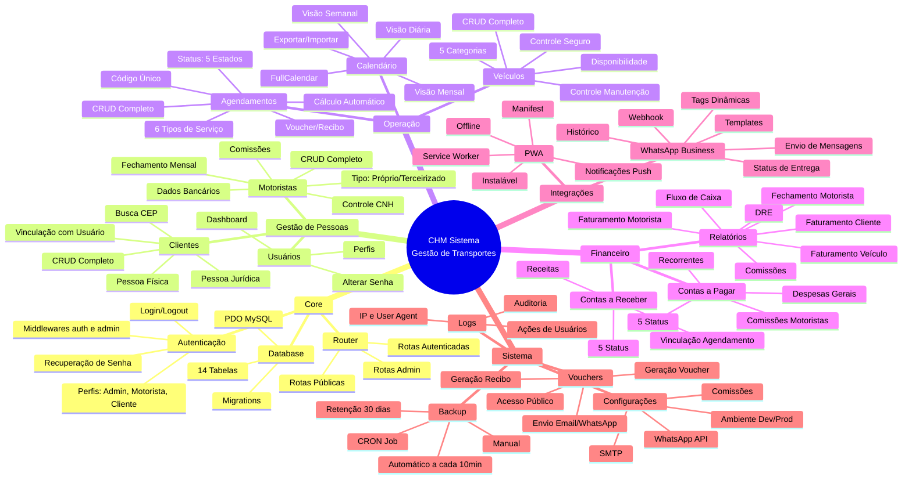
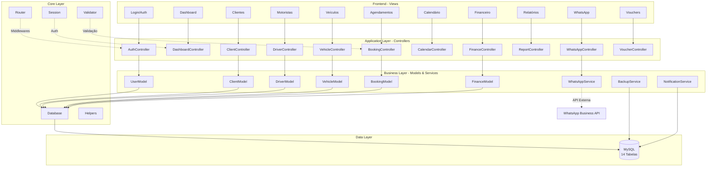
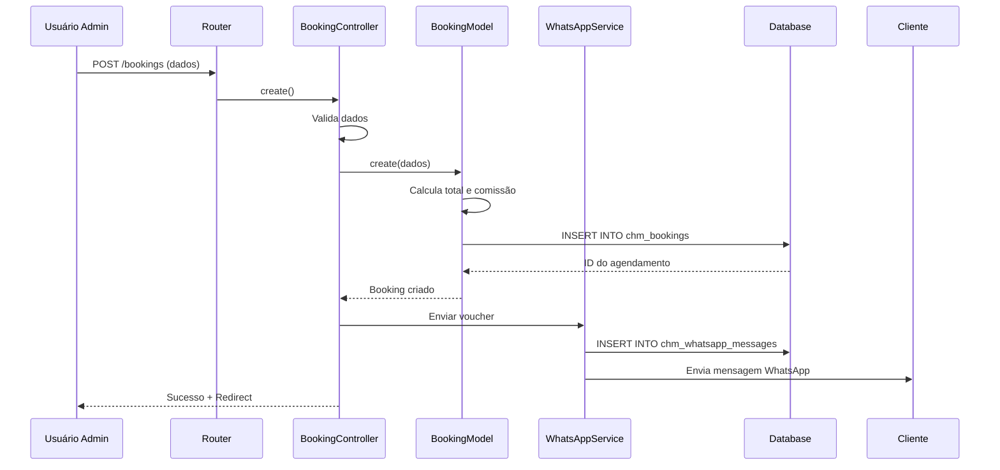
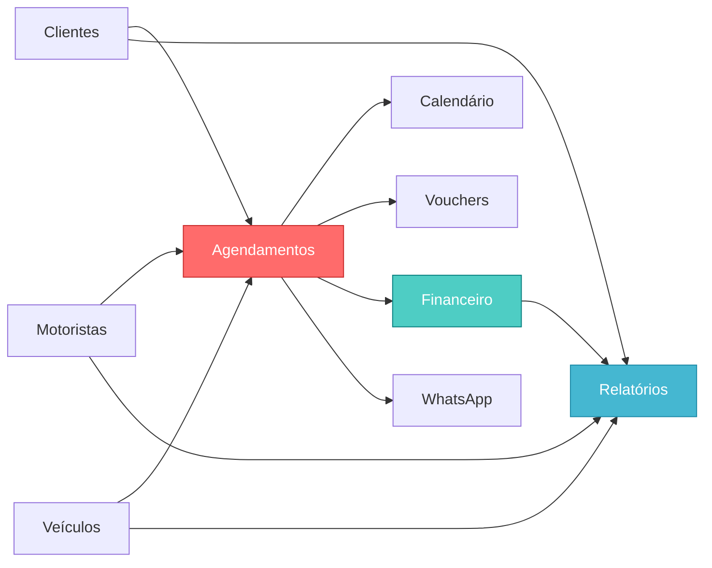

# 🗺️ Mapa Mental - Sistema CHM

---

## 📊 Visão de Camadas

---

## 🔄 Fluxo de Dados - Agendamento

---

## 📦 Módulos por Prioridade de Uso

### Alta Prioridade (Uso Diário)
1. **Agendamentos** - Núcleo do sistema
2. **Calendário** - Visualização operacional
3. **Clientes** - Base cadastral
4. **Motoristas** - Recursos operacionais
5. **Veículos** - Recursos operacionais

### Média Prioridade (Uso Semanal/Mensal)
6. **Financeiro** - Controle de contas
7. **Relatórios** - Análise gerencial
8. **Vouchers** - Documentação

### Baixa Prioridade (Uso Eventual)
9. **WhatsApp** - Notificações automatizadas
10. **Backup** - Manutenção do sistema

---

## 🎯 Dependências entre Módulos

**Legenda:**
- **Vermelho (Agendamentos):** Módulo central - tudo depende dele
- **Verde-água (Financeiro):** Alimentado por agendamentos
- **Azul (Relatórios):** Consolidação de dados

---

## ⚙️ Tecnologias por Camada

| Camada | Tecnologias |
|--------|-------------|
| **Frontend** | HTML5, CSS3, JavaScript Vanilla, FullCalendar.js |
| **Backend** | PHP 7.4+, Arquitetura MVC, PSR-4 Autoloader |
| **Database** | MySQL 8.0 / MariaDB, PDO, Prepared Statements |
| **Security** | bcrypt, CSRF Protection, SQL Injection Prevention |
| **PWA** | Service Worker, Web Manifest, Offline Support |
| **Integration** | WhatsApp Business API (Graph API v18.0) |
| **Server** | Apache 2.4, .htaccess, mod_rewrite |
| **DevOps** | CRON Jobs, Automated Backups, Git |

---

## 📌 Status de Implementação

| Módulo | Status | Observações |
|--------|--------|-------------|
| ✅ Autenticação | 100% | Login, recuperação de senha, perfis |
| ✅ Clientes | 100% | CRUD completo PF/PJ |
| ✅ Motoristas | 100% | CRUD completo + comissões |
| ✅ Veículos | 100% | CRUD completo + manutenção |
| ✅ Agendamentos | 100% | CRUD + status + cálculos |
| ✅ Calendário | 100% | Múltiplas visualizações |
| ✅ Financeiro | 100% | Contas a pagar/receber |
| ✅ Relatórios | 100% | 9 tipos de relatórios |
| ✅ Vouchers | 100% | Geração + envio |
| ⏳ WhatsApp | 90% | Estrutura pronta, pendente config API |
| ⏳ PWA | 80% | Instalável, mas não responsivo |
| ✅ Backup | 100% | Automático + manual |

---

*Mapa mental criado em 26/12/2025 - Análise do Sistema CHM*
